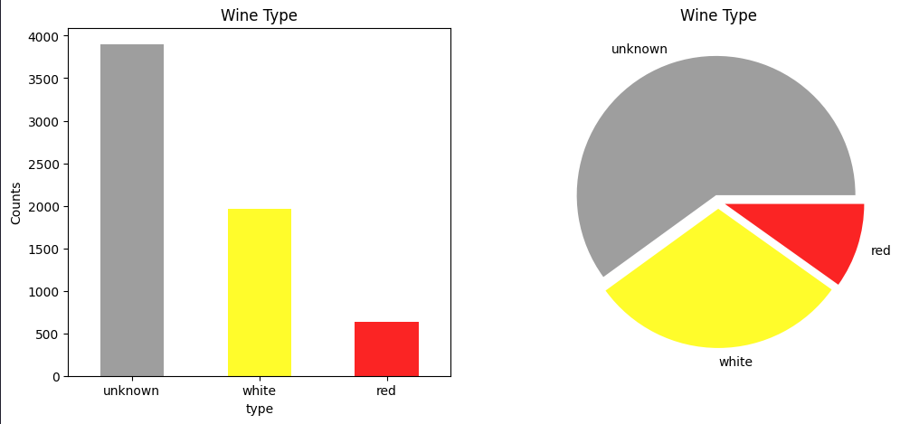
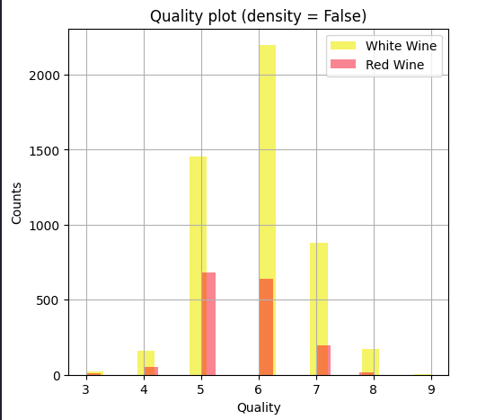

# 🍷 Wine Quality Analysis Project

A semi-supervised machine learning project to classify wine types (red/white) and predict wine quality using chemical features. 

---

## 📌 Project Overview
A biological laboratory collected **labeled and unlabeled wine samples** (red and white):
1. **Classify unlabeled wines** using a semi-supervised approach.
2. **Predict wine quality** (0-10 scale) and identify key chemical drivers of quality.

**Datasets Used**:
- `wine_full` dataset: Labeled data (wine type: red/white).
- `wine_missing` dataset: Unlabeled data.

---

## 🛠️ Data Preparation & Semi-Supervised Labeling
- Explored data distributions and performed cleaning.
- Scaled features to normalize the data.

## 🍇 Semi-Supervised Labeling Wine Samples
We employed a semi-supervised approach to assign red or white labels to the unlabeled samples:
- **Model Training:** Built a Random Forest model on the labeled data using balanced weights to handle class imbalances.
- **Semi-Supervised Labeling:** Predicted probabilities for unlabeled samples and set a threshold to assign labels confidently. This process successfully labeled **3823** new samples, with iterative retraining to cover most unknowns.

---

## 🍇 Wine Quality Prediction

### 📊 Analyzing Quality Distribution
- Observed **imbalanced quality scores** in the `wine_full` dataset (e.g., more medium-quality wines).
- Addressed potential bias from this imbalance during modeling.

 *Replace with your image path*

### 🌳 Model Training
- Trained **Decision Tree Regression** models to predict quality scores.
- Manually tested hyperparameters and used **Grid Search with Cross-Validation** to optimize performance.
- Evaluated models using **Mean Absolute Error (MAE)**.
- Extracted **feature importances** and **decision rules** from the best-performing tree.

---

## 🔬 Key Findings  
- Semi-supervised labeling **boosted dataset size** effectively.  
- Quality prediction models highlighted **non-intuitive chemical factors** (e.g., chlorides over sugars).  
- Decision trees provided **interpretable rules** for quality assessment. 
